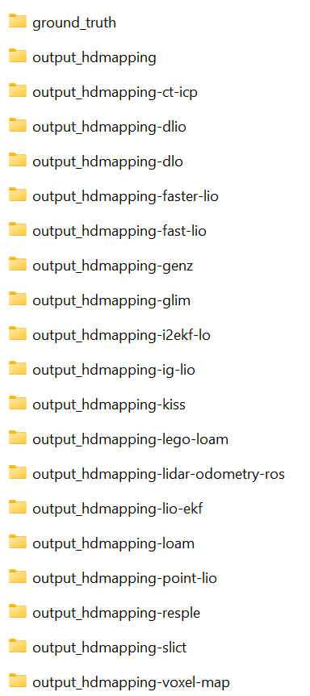
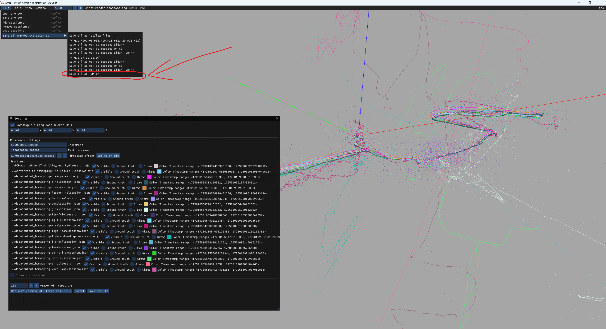

# benchmark-HDMapping-evaluation-of-odometry-and-SLAM
This branch relates with quantitative evaluation of HDMapping-LIO, lidar_odometry_ros_wrapper, RESPLE, GenZ, I2EKF-LO, LIO-EKF, iG-LIO, GLIM, Point-LIO, DLIO, SLICT, KISS-ICP, Faster-LIO, VoxelMap, DLO, CT-ICP, FAST-LIO, LOAM-Livox, Lego-LOAM.

## Step 1

Follow installation instruction at https://github.com/MapsHD/HDMapping.

## Step 2

Prepare ground truth 
- https://github.com/MapsHD/benchmark-HDMapping-ground-truth [[movie]](https://youtu.be/8sHyUNC3mZs)

Execute calculations using branch 'Bunker-DVI-Dataset-reg-1' for all of following repositories
- https://github.com/MapsHD/benchmark-HDMapping_LIO-to-HDMapping [[movie]](https://youtu.be/9AUvPTLUcos)
- https://github.com/MapsHD/benchmark-RESPLE-to-HDMapping [[movie]](https://youtu.be/5PAB4xJmMoo)
- https://github.com/MapsHD/benchmark-GenZ-ICP-to-HDMapping [[movie]](https://youtu.be/vgGkucOBVg4)
- https://github.com/MapsHD/benchmark-I2EKF-LO-to-HDMapping [[movie]](https://youtu.be/B2358Gn62Ho)
- https://github.com/MapsHD/benchmark-LIO-EKF-to-HDMapping [[movie]](https://youtu.be/R4Cn1LJ4U_E)
- https://github.com/MapsHD/benchmark-iG-LIO-to-HDMapping [[movie]](https://youtu.be/KlZf7nHeVmI)
- https://github.com/MapsHD/benchmark-MAD-ICP-to-HDMapping [[movie]](https://youtu.be/zyZDJECqOG0)
- https://github.com/MapsHD/benchmark-Point-LIO-to-HDMapping [[movie]](https://youtu.be/JlD1hDJHcrs)
- https://github.com/MapsHD/benchmark-DLIO-to-HDMapping [[movie]](https://youtu.be/xFLqFcoAtk8)
- https://github.com/MapsHD/benchmark-SLICT-to-HDMapping [[movie]](https://youtu.be/TUaJN7FJOFU)
- https://github.com/MapsHD/benchmark-KISS-ICP-to-HDMapping [[movie]](https://youtu.be/GyB8UuQN0Io)
- https://github.com/MapsHD/benchmark-Faster-LIO-to-HDMapping [[movie]](https://youtu.be/bV1jgF_m-Zo)
- https://github.com/MapsHD/benchmark-VoxelMap-to-HDMapping [[movie]](https://youtu.be/oRiuvJRNl-c)
- https://github.com/MapsHD/benchmark-DLO-to-HDMapping [[movie]](https://youtu.be/-UH81mNLw8Q)
- https://github.com/MapsHD/benchmark-CT-ICP-to-HDMapping [[movie]](https://youtu.be/swEsJHwtE50)
- https://github.com/MapsHD/benchmark-FAST-LIO-to-HDMapping [[movie]](https://youtu.be/ENlaQTtOXEM)
- https://github.com/MapsHD/benchmark-LOAM-Livox-to-HDMapping [[movie]](https://youtu.be/MbKHTmUcI2w)
- https://github.com/MapsHD/benchmark-LeGO-LOAM-to-HDMapping [[movie]](https://youtu.be/WpFBXe1zKto)

You should have data in following folders



## Step 3 (tested on Windows)

Prepare HDMapping project using 'multi_session_registration_step_3' according to the following movie [[qualitative evaluation benchmark movie]](https://youtu.be/C0CcG9vAokY).
Save to 'TUM format' as in following photo.



Create folder 'trajectories_TUM' so data structure should be as follows:

```benchamrk data structure
<benchmark-root>/
├── data/
│   ├── ground_truth/
│   │   └── HDMappingGroundTruth/
│   │       └── lio_result_0/
│   │           └── session.mjs
│   ├── output_hdmapping/
│   │   └── converted_to_hdmapping/
│   │       └── lio_result_0/
│   │           └── session.mjs
│   ├── output_hdmapping-ct-icp/
│   │   └── session.json
│   ├── output_hdmapping-dlio
│   │   └── session.json
│   ├── output_hdmapping-dlo
│   │   └── session.json
│   ├── output_hdmapping-faster-lio
│   │   └── session.json
│   ├── output_hdmapping-fast-lio
│   │   └── session.json
│   ├── output_hdmapping-genz
│   │   └── session.json
│   ├── output_hdmapping-glim
│   │   └── session.json
│   ├── output_hdmapping-i2ekf-lo
│   │   └── session.json
│   ├── output_hdmapping-ig-lio
│   │   └── session.json
│   ├── output_hdmapping-kiss
│   │   └── session.json
│   ├── output_hdmapping-lego-loam
│   │   └── session.json
│   ├── output_hdmapping-lidar-odometry-ros
│   │   └── session.json
│   ├── output_hdmapping-lio-ekf
│   │   └── session.json
│   ├── output_hdmapping-loam
│   │   └── session.json
│   ├── output_hdmapping-point-lio
│   │   └── session.json
│   ├── output_hdmapping-resple
│   │   └── session.json
│   ├── output_hdmapping-slict
│   │   └── session.json
│   └── output_hdmapping-voxel-map
│       └── session.json
└── trajectories_TUM
```

Copy data to 'trajectories_TUM' as follows: 

```bash
cd <benchmark-root>/trajectories_TUM
copy ../data/ground_truth/HDMappingGroundTruth/lio_result_0/lio_result_0_trajectory_tum.txt ground_truth_trajectory_tum.txt
copy ../data/output_hdmapping/converted_to_hdmapping/lio_result_0/lio_result_0_trajectory_tum.txt output_hdmapping_trajectory_tum.txt 
copy ../data/output_hdmapping-ct-icp/output_hdmapping-ct-icp_trajectory_tum.txt output_hdmapping-ct-icp_trajectory_tum.txt 
copy ../data/output_hdmapping-dlio/output_hdmapping-dlio_trajectory_tum.txt output_hdmapping-dlio_trajectory_tum.txt
copy ../data/output_hdmapping-dlo/output_hdmapping-dlo_trajectory_tum.txt output_hdmapping-dlo_trajectory_tum.txt
copy ../data/output_hdmapping-faster-lio/output_hdmapping-faster-lio_trajectory_tum.txt output_hdmapping-faster-lio_trajectory_tum.txt
copy ../data/output_hdmapping-fast-lio/output_hdmapping-fast-lio_trajectory_tum.txt output_hdmapping-fast-lio_trajectory_tum.txt
copy ../data/output_hdmapping-genz/output_hdmapping-genz_trajectory_tum.txt output_hdmapping-genz_trajectory_tum.txt
copy ../data/output_hdmapping-glim/output_hdmapping-glim_trajectory_tum.txt output_hdmapping-glim_trajectory_tum.txt
copy ../data/output_hdmapping-i2ekf-lo/output_hdmapping-i2ekf-lo_trajectory_tum.txt output_hdmapping-i2ekf-lo_trajectory_tum.txt
copy ../data/output_hdmapping-ig-lio/output_hdmapping-ig-lio_trajectory_tum.txt output_hdmapping-ig-lio_trajectory_tum.txt
copy ../data/output_hdmapping-kiss/output_hdmapping-kiss_trajectory_tum.txt output_hdmapping-kiss_trajectory_tum.txt
copy ../data/output_hdmapping-lego-loam/output_hdmapping-lego-loam_trajectory_tum.txt output_hdmapping-lego-loam_trajectory_tum.txt
copy ../data/output_hdmapping-lidar-odometry-ros/output_hdmapping-lidar-odometry-ros_trajectory_tum.txt output_hdmapping-lidar-odometry-ros_trajectory_tum.txt
copy ../data/output_hdmapping-lio-ekf/output_hdmapping-lio-ekf_trajectory_tum.txt output_hdmapping-lio-ekf_trajectory_tum.txt
copy ../data/output_hdmapping-loam/output_hdmapping-loam_trajectory_tum.txt output_hdmapping-loam_trajectory_tum.txt
copy ../data/output_hdmapping-point-lio/output_hdmapping-point-lio_trajectory_tum.txt output_hdmapping-point-lio_trajectory_tum.txt
copy ../data/output_hdmapping-resple/output_hdmapping-resple_trajectory_tum.txt output_hdmapping-resple_trajectory_tum.txt
copy ../data/output_hdmapping-slict/output_hdmapping-slict_trajectory_tum.txt output_hdmapping-slict_trajectory_tum.txt
copy ../data/output_hdmapping-voxel-map/output_hdmapping-voxel-map_trajectory_tum.txt output_hdmapping-voxel-map_trajectory_tum.txt
```

```benchamrk data structure
<benchmark-root>/
├── data/
│   ├── ground_truth/
│   │   └── HDMappingGroundTruth/
│   │       └── lio_result_0/
│   │           └── session.mjs
│   ├── output_hdmapping/
│   │   └── converted_to_hdmapping/
│   │       └── lio_result_0/
│   │           └── session.mjs
│   ├── output_hdmapping-ct-icp/
│   │   └── session.json
│   ├── output_hdmapping-dlio
│   │   └── session.json
│   ├── output_hdmapping-dlo
│   │   └── session.json
│   ├── output_hdmapping-faster-lio
│   │   └── session.json
│   ├── output_hdmapping-fast-lio
│   │   └── session.json
│   ├── output_hdmapping-genz
│   │   └── session.json
│   ├── output_hdmapping-glim
│   │   └── session.json
│   ├── output_hdmapping-i2ekf-lo
│   │   └── session.json
│   ├── output_hdmapping-ig-lio
│   │   └── session.json
│   ├── output_hdmapping-kiss
│   │   └── session.json
│   ├── output_hdmapping-lego-loam
│   │   └── session.json
│   ├── output_hdmapping-lidar-odometry-ros
│   │   └── session.json
│   ├── output_hdmapping-lio-ekf
│   │   └── session.json
│   ├── output_hdmapping-loam
│   │   └── session.json
│   ├── output_hdmapping-point-lio
│   │   └── session.json
│   ├── output_hdmapping-resple
│   │   └── session.json
│   ├── output_hdmapping-slict
│   │   └── session.json
│   └── output_hdmapping-voxel-map
│       └── session.json
└── trajectories_TUM
    ├── ground_truth_trajectory_tum.txt
    ├── output_hdmapping_trajectory_tum.txt
    ├── output_hdmapping-ct-icp_trajectory_tum.txt
    ├── output_hdmapping-dlio_trajectory_tum.txt
    ├── output_hdmapping-dlo_trajectory_tum.txt
    ├── output_hdmapping-faster-lio_trajectory_tum.txt
    ├── output_hdmapping-fast-lio_trajectory_tum.txt
    ├── output_hdmapping-genz_trajectory_tum.txt
    ├── output_hdmapping-glim_trajectory_tum.txt
    ├── output_hdmapping-i2ekf-lo_trajectory_tum.txt
    ├── output_hdmapping-ig-lio_trajectory_tum.txt
    ├── output_hdmapping-kiss_trajectory_tum.txt
    ├── output_hdmapping-lego-loam_trajectory_tum.txt
    ├── output_hdmapping-lidar-odometry-ros_trajectory_tum.txt
    ├── output_hdmapping-lio-ekf_trajectory_tum.txt
    ├── output_hdmapping-loam_trajectory_tum.txt
    ├── output_hdmapping-point-lio_trajectory_tum.txt
    ├── output_hdmapping-resple_trajectory_tum.txt
    ├── output_hdmapping-slict_trajectory_tum.txt
    └── output_hdmapping-voxel-map_trajectory_tum.txt
```

## Step 4 (plot trajectories)
Follow installation instruction at https://github.com/MichaelGrupp/evo.

Execute following command:

```bash
cd <benchmark-root>/trajectories_TUM
evo_traj tum ground_truth_trajectory_tum.txt output_hdmapping_trajectory_tum.txt output_hdmapping-ct-icp_trajectory_tum.txt output_hdmapping-dlio_trajectory_tum.txt output_hdmapping-dlo_trajectory_tum.txt output_hdmapping-faster-lio_trajectory_tum.txt output_hdmapping-fast-lio_trajectory_tum.txt output_hdmapping-genz_trajectory_tum.txt output_hdmapping-glim_trajectory_tum.txt output_hdmapping-i2ekf-lo_trajectory_tum.txt output_hdmapping-ig-lio_trajectory_tum.txt output_hdmapping-kiss_trajectory_tum.txt output_hdmapping-lego-loam_trajectory_tum.txt output_hdmapping-lidar-odometry-ros_trajectory_tum.txt output_hdmapping-lio-ekf_trajectory_tum.txt output_hdmapping-loam_trajectory_tum.txt output_hdmapping-point-lio_trajectory_tum.txt output_hdmapping-resple_trajectory_tum.txt output_hdmapping-slict_trajectory_tum.txt output_hdmapping-voxel-map_trajectory_tum.txt --plot_mode=xy -p --ref ground_truth_trajectory_tum.txt
```

## Step 5 (calculate APE - absolute pose error)

Execute following command:

```bash
cd <benchmark-root>/trajectories_TUM
evo_ape.exe tum ground_truth_trajectory_tum.txt output_hdmapping_trajectory_tum.txt -a
evo_ape.exe tum ground_truth_trajectory_tum.txt output_hdmapping-ct-icp_trajectory_tum.txt -a
evo_ape.exe tum ground_truth_trajectory_tum.txt output_hdmapping-dlio_trajectory_tum.txt -a
evo_ape.exe tum ground_truth_trajectory_tum.txt output_hdmapping-dlo_trajectory_tum.txt -a
evo_ape.exe tum ground_truth_trajectory_tum.txt output_hdmapping-faster-lio_trajectory_tum.txt -a
evo_ape.exe tum ground_truth_trajectory_tum.txt output_hdmapping-fast-lio_trajectory_tum.txt -a
evo_ape.exe tum ground_truth_trajectory_tum.txt output_hdmapping-genz_trajectory_tum.txt -a
evo_ape.exe tum ground_truth_trajectory_tum.txt output_hdmapping-glim_trajectory_tum.txt -a
evo_ape.exe tum ground_truth_trajectory_tum.txt output_hdmapping-i2ekf-lo_trajectory_tum.txt -a
evo_ape.exe tum ground_truth_trajectory_tum.txt output_hdmapping-ig-lio_trajectory_tum.txt -a
evo_ape.exe tum ground_truth_trajectory_tum.txt output_hdmapping-kiss_trajectory_tum.txt -a
evo_ape.exe tum ground_truth_trajectory_tum.txt output_hdmapping-lego-loam_trajectory_tum.txt -a
evo_ape.exe tum ground_truth_trajectory_tum.txt output_hdmapping-lidar-odometry-ros_trajectory_tum.txt -a
evo_ape.exe tum ground_truth_trajectory_tum.txt output_hdmapping-lio-ekf_trajectory_tum.txt -a
evo_ape.exe tum ground_truth_trajectory_tum.txt output_hdmapping-loam_trajectory_tum.txt -a
evo_ape.exe tum ground_truth_trajectory_tum.txt output_hdmapping-point-lio_trajectory_tum.txt -a
evo_ape.exe tum ground_truth_trajectory_tum.txt output_hdmapping-resple_trajectory_tum.txt -a
evo_ape.exe tum ground_truth_trajectory_tum.txt output_hdmapping-slict_trajectory_tum.txt -a
evo_ape.exe tum ground_truth_trajectory_tum.txt output_hdmapping-voxel-map_trajectory_tum.txt -a
```

Concatenate results into following table (APE - absolute pose error):

|                    | max      | mean     | median   | min      | rmse     | sse       | std      |
| :---:              | :---:    | :---:    | :---:    | :---:    | :---:    | :---:     | :---:    |
| hdmapping_lio      | 0.302556 | 0.053789 | 0.051380 | 0.000633 | 0.062583 | 256.53924 | 0.031990 | 
| ct-icp             | 0.666496 | 0.211218 | 0.174998 | 0.041055 | 0.242838 | 193.00931 | 0.119821 |
| dlio               | 1.203014 | 0.195927 | 0.180943 | 0.014603 | 0.212762 | 1482.2399 | 0.082945 |
| dlo                | 1.017893 | 0.327377 | 0.285013 | 0.127095 | 0.366897 | 440.72542 | 0.165645 |
| faster-lio         | 0.347235 | 0.127601 | 0.105748 | 0.010635 | 0.151864 | 75.507115 | 0.082344 |
| fast-lio           | 0.357433 | 0.131987 | 0.124529 | 0.000690 | 0.145813 | 69.610126 | 0.061974 |
| genz               | 0.488600 | 0.169859 | 0.119617 | 0.004529 | 0.209698 | 123.08170 | 0.122969 |
| glim               | 53.31329 | 24.89923 | 22.24682 | 8.054237 | 26.91718 | 2372127.7 | 10.22561 |
| i2ekf-lo           | 0.299496 | 0.089043 | 0.084234 | 0.004999 | 0.098937 | 11.971344 | 0.043126 |
| ig-lio             | 0.635094 | 0.259547 | 0.229687 | 0.010365 | 0.288841 | 273.14620 | 0.126744 |
| kiss-icp           | 57.23357 | 21.27990 | 17.94439 | 6.451049 | 25.04907 | 2053663.7 | 13.21445 |
| lego-loam          | 45.38227 | 19.31593 | 16.35771 | 4.025432 | 22.07724 | 392848.28 | 10.69109 |
| lidar-odometry-ros | 36.09209 | 13.96986 | 12.36597 | 2.147020 | 16.29795 | 869120.02 | 8.394422 |
| lio-ekf            | 361.0541 | 174.1565 | 179.7231 | 15.12114 | 194.9721 | 124268234 | 87.65638 |
| loam               | -        | -        | -        | -        | -        | -         | -        |
| point-lio          | 0.389449 | 0.151193 | 0.128220 | 0.006296 | 0.170734 | 95.437209 | 0.079314 |
| resple             | 22.00656 | 6.931513 | 5.190022 | 1.623168 | 8.480002 | 229681.91 | 4.885136 |
| slict              | 1270.128 | 563.9430 | 473.4318 | 74.99585 | 658.1596 | 471726602 | 339.3262 |
| voxel_map          | -        | -        | -        | -        | -        | -         | -        |

## Step 6 (calculate RPE - relative pose error)

Execute following command:

```bash
cd <benchmark-root>/trajectories_TUM
evo_rpe.exe tum ground_truth_trajectory_tum.txt output_hdmapping_trajectory_tum.txt -a
evo_rpe.exe tum ground_truth_trajectory_tum.txt output_hdmapping-ct-icp_trajectory_tum.txt -a
evo_rpe.exe tum ground_truth_trajectory_tum.txt output_hdmapping-dlio_trajectory_tum.txt -a
evo_rpe.exe tum ground_truth_trajectory_tum.txt output_hdmapping-dlo_trajectory_tum.txt -a
evo_rpe.exe tum ground_truth_trajectory_tum.txt output_hdmapping-faster-lio_trajectory_tum.txt -a
evo_rpe.exe tum ground_truth_trajectory_tum.txt output_hdmapping-fast-lio_trajectory_tum.txt -a
evo_rpe.exe tum ground_truth_trajectory_tum.txt output_hdmapping-genz_trajectory_tum.txt -a
evo_rpe.exe tum ground_truth_trajectory_tum.txt output_hdmapping-glim_trajectory_tum.txt -a
evo_rpe.exe tum ground_truth_trajectory_tum.txt output_hdmapping-i2ekf-lo_trajectory_tum.txt -a
evo_rpe.exe tum ground_truth_trajectory_tum.txt output_hdmapping-ig-lio_trajectory_tum.txt -a
evo_rpe.exe tum ground_truth_trajectory_tum.txt output_hdmapping-kiss_trajectory_tum.txt -a
evo_rpe.exe tum ground_truth_trajectory_tum.txt output_hdmapping-lego-loam_trajectory_tum.txt -a
evo_rpe.exe tum ground_truth_trajectory_tum.txt output_hdmapping-lidar-odometry-ros_trajectory_tum.txt -a
evo_rpe.exe tum ground_truth_trajectory_tum.txt output_hdmapping-lio-ekf_trajectory_tum.txt -a
evo_rpe.exe tum ground_truth_trajectory_tum.txt output_hdmapping-loam_trajectory_tum.txt -a
evo_rpe.exe tum ground_truth_trajectory_tum.txt output_hdmapping-point-lio_trajectory_tum.txt -a
evo_rpe.exe tum ground_truth_trajectory_tum.txt output_hdmapping-resple_trajectory_tum.txt -a
evo_rpe.exe tum ground_truth_trajectory_tum.txt output_hdmapping-slict_trajectory_tum.txt -a
evo_rpe.exe tum ground_truth_trajectory_tum.txt output_hdmapping-voxel-map_trajectory_tum.txt -a
```

Concatenate results into following table (RPE - relative pose error):

|                    | max      | mean     | median   | min      | rmse     | sse      | std      |
| :---:              | :---:    | :---:    | :---:    | :---:    | :---:    | :---:    | :---:    |
| hdmapping_lio      | 0.026669 | 0.001612 | 0.001426 | 0.000000 | 0.002018 | 0.266823 | 0.001215 | 
| ct-icp             | 0.170148 | 0.023061 | 0.020382 | 0.001367 | 0.026755 | 2.342112 | 0.013565 |
| dlio               | 1.093084 | 0.021576 | 0.012364 | 0.000000 | 0.038824 | 49.35438 | 0.032277 |
| dlo                | 0.183737 | 0.015045 | 0.011616 | 0.000439 | 0.019664 | 1.265524 | 0.012661 |
| faster-lio         | 0.166162 | 0.005490 | 0.004920 | 0.000518 | 0.007506 | 0.184422 | 0.005119 |
| fast-lio           | 0.154157 | 0.006580 | 0.005684 | 0.000405 | 0.008558 | 0.239704 | 0.005472 |
| genz               | 0.162090 | 0.009768 | 0.008770 | 0.000160 | 0.011779 | 0.388194 | 0.006583 |
| glim               | 0.989137 | 0.051066 | 0.030066 | 0.001327 | 0.091262 | 27.25978 | 0.075637 |
| i2ekf-lo           | 0.153804 | 0.009901 | 0.008268 | 0.000481 | 0.013135 | 0.210836 | 0.008632 |
| ig-lio             | 0.154341 | 0.012851 | 0.010856 | 0.000778 | 0.015633 | 0.799884 | 0.008902 |
| kiss-icp           | 0.760740 | 0.102368 | 0.086851 | 0.005766 | 0.123726 | 50.08825 | 0.069491 |
| lego-loam          | 5.699232 | 0.321794 | 0.321513 | 0.003122 | 0.399876 | 128.7203 | 0.237381 |
| lidar-odometry-ros | 0.984388 | 0.009174 | 0.007499 | 0.000424 | 0.020608 | 1.389191 | 0.018454 |
| lio-ekf            | 1.125873 | 0.233184 | 0.188362 | 0.004624 | 0.278770 | 253.9659 | 0.152768 |
| loam               | -        | -        | -        | -        | -        | -        | -        |
| point-lio          | 0.158866 | 0.010723 | 0.009878 | 0.000534 | 0.012579 | 0.517904 | 0.006576 |
| resple             | 0.218377 | 0.062758 | 0.062635 | 0.000000 | 0.069234 | 15.30499 | 0.029236 |
| slict              | 5.427715 | 2.860021 | 3.026210 | 0.341203 | 2.965140 | 9565.756 | 0.782519 |
| voxel_map          | -        | -        | -        | -        | -        | -         | -       |

## MOVIE


